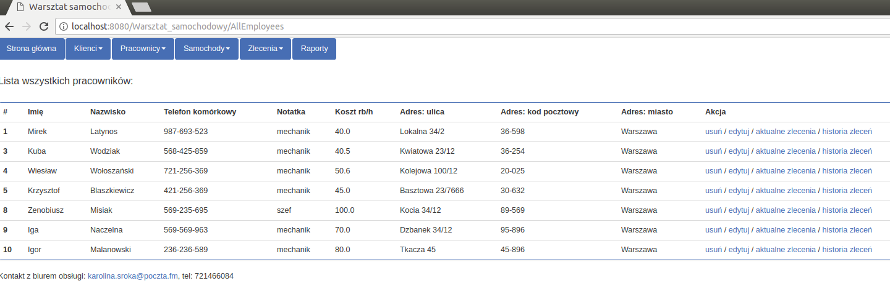
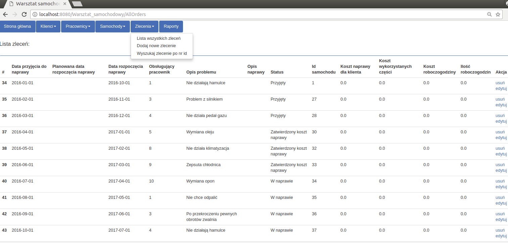

## Warsztat_samochodowy

### FUNCTIONALITY (actualization 8.02.2018)

CRM (Customer Relationship Management) web application for the car Workshop.
Its dedicated for its employees.

Functionality:
	
	- customers: add / modify/ delete /show all/ find by surname/ cars list
	- employees: add / modify / delete/ show all/ actual order/ order history
	- cars: add / modify / delete/ show all/ order history
	- orders: add / modify / delete/ show all/ find by id
	- (in the future: generate reports about budget per unit also to Excel - using ApachePOI).

[ Java, Servlets, JSP, DAO, SQL]

### DATABASE (actualization 8.02.2018)

### PRINTSCREENS (actualization 8.02.2018)

